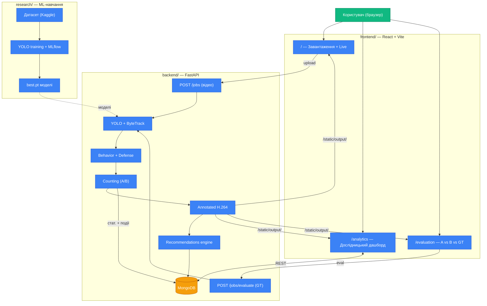

# Bee Monitoring System (BuzzTrack)

Комплексна AI-система для комп'ютерного зору та аналізу поведінки бджіл на прилітній дошці вулика. Проєкт створено для автоматизованого моніторингу активності бджолиних сімей, підрахунку трафіку (вліт/виліт), розпізнавання поведінкових патернів за академічною специфікацією PLOS ONE 2025 та формування дієвих рекомендацій пасічнику.


---

## Архітектура проєкту

Система побудована як монорепозиторій із трьох повністю незалежних модулів. Кожен має власний `README.md` з детальною інструкцією.



1. **`research/` — ML & MLOps середовище**
   - Навчання моделей YOLO-pose для визначення пози бджіл (голова + жало) та детектора рампи (4 кутових keypoints).
   - Hydra-конфіг, трекінг експериментів через DagsHub/MLflow.
   - Детальна інструкція: [research/README.md](research/README.md).

2. **`backend/` — REST API сервер (FastAPI)**
   - 7-стадійний пайплайн обробки відео: Detection → Tracking → TrackUpdate → Behavior → **Defense** → Counting → Annotation.
   - Класифікація поведінки за академічною специфікацією PLOS ONE 2025: фуражування, вентиляція, полірування, захист.
   - Два методи підрахунку (A — траєкторія, B — pose-validated) з прозорим аудитом «що відсіяно».
   - Evaluation-режим проти ground-truth датасету `tracking_and_behavior` (TP/FP/FN, F1, MAE).
   - Rule-based recommendations engine для пасічника.
   - Детальна інструкція: [backend/README.md](backend/README.md).

3. **`frontend/` — Веб-інтерфейс (React 19 + TypeScript + Vite)**
   - Три сторінки: Завантаження (live-моніторинг), Аналітика (порівняння A vs B), Точність (auto A vs B vs GT).
   - Спільний `VideoPlayer` зі швидкостями 0.25×–4× та YouTube-style клавішами.
   - Демо-готові компоненти: `RecommendationsSection`, `PoseFilterCard`, `SideBySideVideoPlayer`.
   - Детальна інструкція: [frontend/README.md](frontend/README.md).

---

## Швидкий старт

Потрібна запущена **MongoDB** (локально або Docker). Все Python-середовище — через `uv`.

```bash
# 1. Backend
cd backend && uv sync && uv run uvicorn main:app --host 0.0.0.0 --port 8000 --reload

# 2. Frontend (інше терміналом)
cd frontend && npm install && npm run dev   # http://localhost:5173
```

Потрібно у `backend/.env`:

```env
MONGO_URI=mongodb://localhost:27017
```

Та у `frontend/.env`:

```env
VITE_API_URL=http://localhost:8000
```

---

## Ключові фічі

- **Підрахунок трафіку** з прозорим показом «що відсіяв pose-фільтр» на самому відео (сірий glow «✗ pose» на бджолах, які зарахував би лише Approach A).
- **Defense detection** — кластерний детектор охоронців довкола чужинців (PLOS ONE Rdef/Adef/Tdef).
- **Evaluation на GT** — сторінка `/evaluation` запускає A і B паралельно проти однакових ground-truth анотацій з датасету `tracking_and_behavior` і показує переможця по 4 метриках.
- **Live event ticker** — стрічка останніх 10 подій під час обробки.
- **Поради пасічнику** — рекомендації з severity (info/warning/critical): висока вентиляція → перегрів, дисбаланс трафіку → роєння, defense events → атака.

---
*Зроблено для дослідження та автоматизації пасік.*
