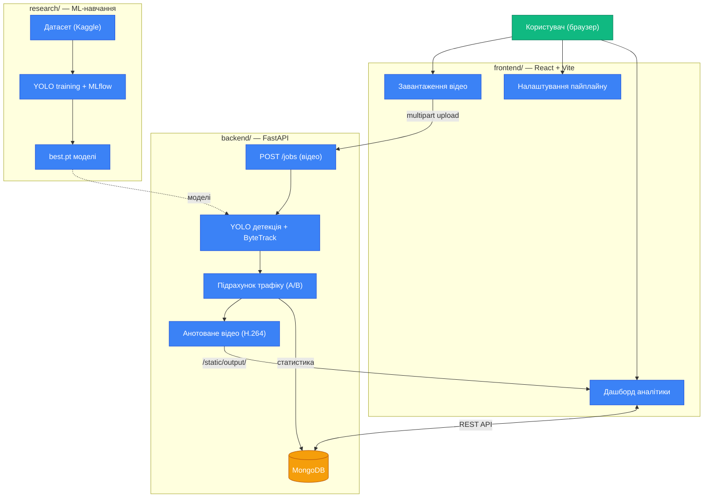

# Bee Monitoring System (BuzzTrack)

Комплексна AI-система для комп'ютерного зору та аналізу поведінки бджіл на прилітній дошці вулика. Проєкт створено для автоматизованого моніторингу активності бджолиних сімей, підрахунку трафіку (вліт/виліт) та розпізнавання патернів поведінки.

---

## Архітектура проєкту

Система побудована як монорепозиторій і складається з трьох повністю незалежних компонентів. Кожен модуль має власну детальну інструкцію в своєму `README.md`.

1. **`research/` — ML & MLOps середовище**
   - Навчання моделей YOLO-pose для визначення пози бджіл та детектора дошки.
   - Детальна інструкція: [research/README.md](research/README.md).

2. **`backend/` — REST API сервер (FastAPI)**
   - Процесує відео, здійснює трекінг та аналіз поведінки за допомогою YOLO та ByteTrack.
   - Детальна інструкція: [backend/README.md](backend/README.md).

3. **`frontend/` — Веб-інтерфейс (React + TypeScript + Vite)**
   - Дашборд для завантаження відео, налаштування пайплайну та перегляду аналітики та результатів.
   - Детальна інструкція: [frontend/README.md](frontend/README.md).

---

## Швидкий старт (Загальний огляд)

Для роботи системи потрібна запущена **MongoDB**. Система запускається модульно:

1. Запустіть бекенд через UV (`uv run uvicorn...`).
2. Запустіть фронтенд через npm (`npm run dev`).

Більш детальну інструкцію по кожному модулю шукайте в їхніх відповідних `README.md`.

---
*Зроблено для дослідження та автоматизації пасік.*
